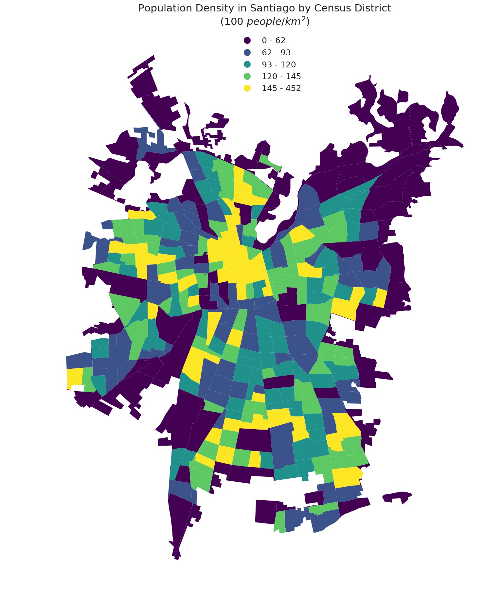

# PUI Homework 11 by Pablo Mandiola (pmb434)

## Assignment 1

For this assignment we analized a time series of weekly rides in the NYC subway, by station and card type, using two random forest classifiers.

[Link to Jupyter Notebook](HW11_1_pmb434.ipynb)

## Assignment 2

I updated my plot from Homework 8 following my classmates' reviews:

- Changed from Census Block to Census District to increase the size of the areas.
- Made the legend more legible by formatting the number and reducing the units.
- Reduced the nomber of quantiles from 5 to 10 to imporve legibility.
- Added a better caption

**This is a map of the population density in Santiago by Census District. It is easy to recognize the Downtown area in the center of the city, where there is a high population density. It is also interesting to note that there are pockets of high density in the outer parts of the city in all directions but the North East; this is were the high income suburbs are located.**

[Link to Jupyter Notebook](HW11_2_pmb434.ipynb)
