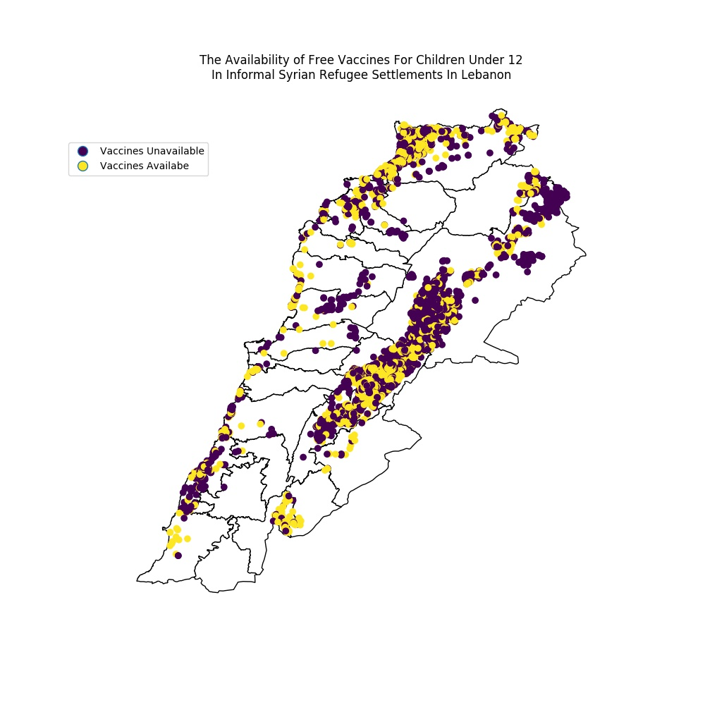

# Linda Jaber's plot review, by Pablo Mandiola

## Plot

**The figure above is a map of Lebanon showing the boundaries of Cazas or Districts.
The locations of informal syrian refugee settlements are plotted on the map.
This shows us how the settlements are concentrated in the east districts of the country as well as in those in the north.
The locations are color coded by the availability of free vaccines for children under 12 years old,
where dark circles indicate unavailability. We notice that a significant number of settlements lacking vaccination.**

## Review

**Clarity:** The use of points for the locations of Syrian refugee camps is fine to show areas of higher and lower concentration of camps. However, this could be improved using some transparency as it would better highlight higher concentration areas when data points overlap with each other. The categorization of camps by vaccine availability seems to have some spatial clustering, but it could be because of the order in which camps are plotted on top of each other. Again, adding transparency might be useful.

**Esthetic:** Using a white background map with fine black borders is a good choice as it helps the viewer concentrate on the points, giving enough context and without unnecessary distraction. Yellow and purple are also good choices of colors for the points, as they both stand out from the background while also being of high contrast between them for easy differentiation.

**Honesty:** The plot does not make any unnecessary adjustments to the data in order to make a point, it shows the location of Syrian refugee camps in Lebanon and its availability of vaccines.
